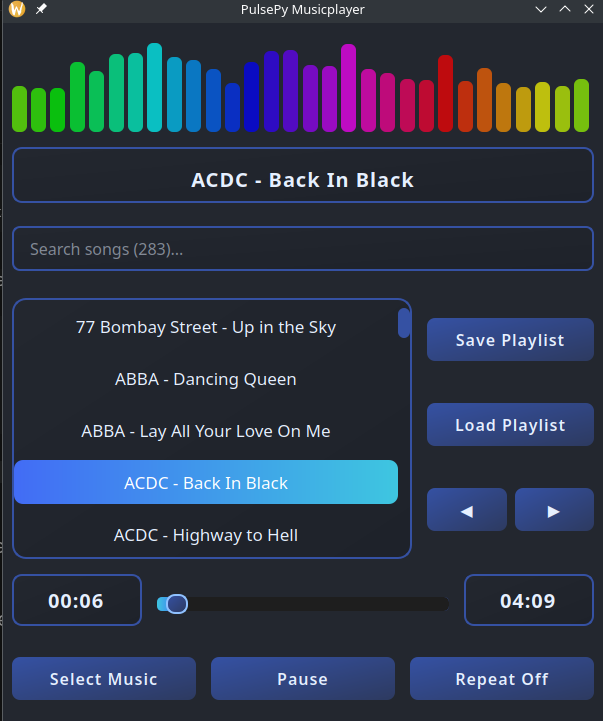

🎵 **Pulsepy - A Simple and Sweet One File Music Player** 🎵

Enjoy your local music files with this straightforward PyQt5 player.

**Features:**

* Clean and intuitive user interface.
* Effortless playback of local music files.
* Basic playback controls (play, pause, stop).
* Different modes: Shuffle, Repeat One, Repeat All
* Save/Load your playlists in a universal format
* Playlist modification via drag & drop of the songs
* Dynamic Equalizer
* \[Future: Enhanced visual experience with integrated icons]

**Downloads:**

* Ready-to-use builds: [Link to your releases](https://github.com/Program-Adam/Pulsepy/releases/tag/v1.0.0)

**Quick Start (development):**

Built with Python 3.11.8 and PyQt5.

    python3.11 -m venv .venv && \
    source .venv/bin/activate && \
    pip install -r requirements.txt && \
    python main.py

**Window Executable Creation:**

**Linux AppImage Creation:**

    cd pulsepy/

    mkdir build && \
    wget https://github.com/AppImage/appimagetool/releases/download/continuous/appimagetool-x86_64.AppImage -O ./build/appimagetool-x86_64.AppImage && \
    chmod +x ./build/appimagetool-x86_64.AppImage

    ./build/linuxdeploy-x86_64.AppImage \
      --appdir . \
      --desktop-file ./pulsepy.desktop \
      --icon-file ./icon.png \
      --output appimage && \
    mv PulsePy_Music_Player-x86_64.AppImage ./build/release/PulsePy-x86_64.AppImage

**Credits:**

Icon: [Music icons created by Freepik - Flaticon](https://www.flaticon.com/free-icons/music)
